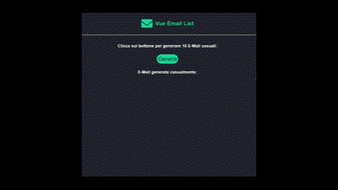

Esercizio: Vue Email List

Nome Repo: vue-email-list

Descrizione:
Attraverso l'apposita API di Boolean
https://flynn.boolean.careers/exercises/api/random/mail
generare 10 indirizzi email e stamparli in pagina all'interno di una lista.

Bonus:
Far comparire gli indirizzi email solamente quando sono stati tutti generati.

 <h1 align="center">Anteprima<h1>

